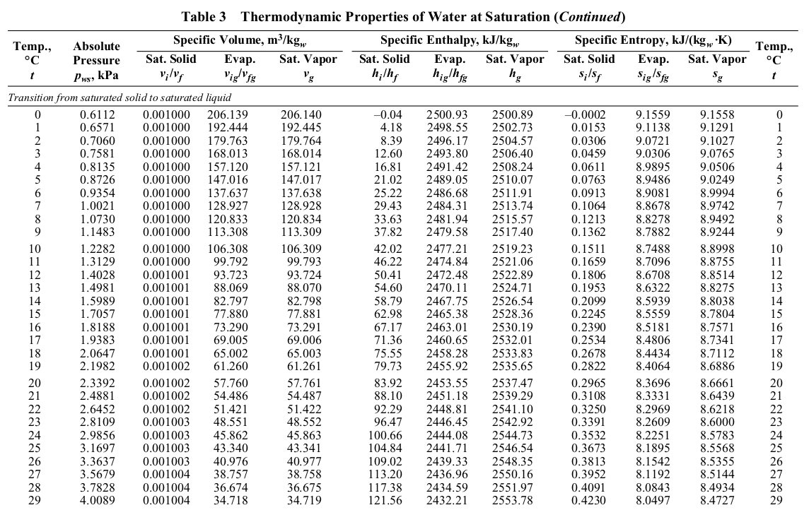

# 1. PSYCHROMETRICS
Psychrometrics are the study of physical and thermodynamic properties of moist air, i.e.,
the use of thermodynamic properties to analyse conditions and processes involving moist air.

## 1.1 Dry and moist air composition
**Atmospheric air:** Contains gaseous components as well as water vapor and miscellaneous contaminants

**Dry air:** Atmospheric air with all water vapor and contaminants removed. 

**Moist air:** Mixture of dry air and water vapor. The amount of water vapor varies from zero (dry air) to a maximum that 
depends on temperature and pressure. 

**Saturation:** State of equilibrium between moist air and condensed water phase (liquid or solid).  

## 1.2 Standard atmosphere
Temperature and barometric pressure of air varies with altitude and with local geographic and weather conditions.
The standard atmosphere allows to estimate properties at various altitudes.
* 15C° = standard temperature
* 101.325kPa = standard barometric pressure
* Lower atmophere is assumed to consist of dry air that behaves as a perfect gas
* 9.80665 m/s2

## 1.3 Moist air thermodynamic properties
Based on International Temperature Scale (ITS-90).

Thermodynamic Properties of Moist Air at Standard Atmospheric Pressure, 101.325kPa

## 1.4 Thermodynamic properties of water at saturation
Based on ITS-90. For detailed formulas refered to ASHRAE fundamentals, 2017.

## 1.5 Humidity parameters
**Basic parameters**
* Humidity ratio (or mixing ratio)
* Specific humidity
* Absolute humidity 
* Density

**Humidity parameters involving saturation** (moist air saturation)
* Saturation humidity ratio
* Relative humidity 
* Dew-point temperature
* Thermodynamic wet-bulb temperature

