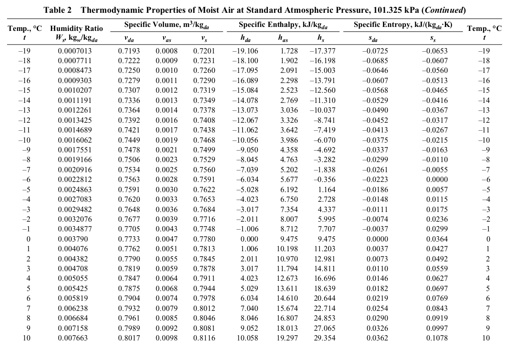

# 1. PSYCHROMETRICS
Psychrometrics are the study of physical and thermodynamic properties of moist air, i.e.,
the use of thermodynamic properties to analyse conditions and processes involving moist air.

## 1.1 Dry and moist air composition
### Atmospheric air 

Contains gaseous components as well as water vapor and miscellaneous contaminants

### Dry air

Atmospheric air with all water vapor and contaminants removed. 

### Moist air 

Mixture of dry air and water vapor. The amount of water vapor varies from zero (dry air) to a maximum that 
depends on temperature and pressure. 

### Saturation

State of equilibrium between moist air and condensed water phase (liquid or solid).  

## 1.2 Standard atmosphere
Temperature and barometric pressure of air varies with altitude and with local geographic and weather conditions.
The standard atmosphere allows to estimate properties at various altitudes.
* 15C° = standard temperature
* 101.325kPa = standard barometric pressure
* Lower atmophere is assumed to consist of dry air that behaves as a perfect gas
* 9.80665 m/s2

## 1.3 Moist air thermodynamic properties
Based on International Temperature Scale (ITS-90). Thermodynamic Properties of Moist Air at Standard Atmospheric Pressure, 101.325kPa

* Humidity ratio at saturation **(Ws)**   

* Specific volume of dry air **(Vda)**

* Specific volume difference of Vs-Vda **(Vas)**

* Specific volume of moist air at saturation **(Vs)**

* Specific enthalpy of dry air **(Vda)**

* Specific enthalpy difference of Hs-Hda **(has)** 

* Specific enthalpy of moist air at saturation **(hs)**

* Specific entropy of dry air **(Sda)**

* Specific entropy of moist air at saturation **(Ss)** 

## 1.4 Thermodynamic properties of water at saturation (saturated liquid)
Based on ITS-90. For detailed formulas refered to ASHRAE fundamentals, 2017.

The water vapor saturation pressure (pws) is required to determine
a number of moist air properties, principally the saturation humid-
ity ratio (Ws)

* Absolute pressure (saturation pressure)  **(Pws)**
* vapor pressure (ps) can be used in equations in
place of pws with very little error: ps=XwsP 

## 1.5 Humidity parameters
**Basic parameters**
* **Humidity ratio (or mixing ratio):** Ratio of the mass of water vapor to the mass of dry air
* **Specific humidity:** Ratio of the mass of water vapor to total mass of moist air sample 
* **Absolute humidity (water vapor density):** Ratio of the mass of water vapor to total volume sample 
* **Density:** (of a moist air mixture) is the ratio of total mass to total volume

**Humidity parameters involving saturation** (moist air saturation)
* **Saturation humidity ratio:** Humidity ratio of moist air saturated to water at a same temperature and pressure 
* **Relative humidity:** Ratio of water vapor partial pressure in moist air at dew-point pressure and temperature to 
the reference saturation water vapor partial pressure ar dry-bulb pressure and temperature. 
* **Dew-point temperature:** Temperature of moist air saturated at pressure, with same humidity ratio W as that of the
given sample of moist air.  
* **Thermodynamic wet-bulb temperature:** Temperature at which water, by evaporating into moist air at dry-bulb temperature and humidity ratio,
can bring air to saturation adiabatically at the same temperture while total pressure is constant. 

## 1.6 Perfect gas relationships for dry and moist air

When moist air is considered a mixture of independent perfect gases (dry air and water vapor), perfect gas equation (pV=nRT)  can be 
assumed for each.

### Dry Air

	p ( da ) V = n ( da ) RT

### Water vapor
 
	p ( w ) V = n ( w ) RT

### The mixture also obeys the perfect gas equation:

	( pda + pw ) V = ( nda + nw ) RT

###  Humidity ratio (_W_) (p = pda + pw)

	W = 0.621945 ( pw / p - pw )

### Saturation humidity ration (_Ws_) is:

	Ws = 0.621945 ( pws / p - pws )

Where:

pda = Partial pressure of dry air
pw = Partial pressure of water vapor
V = Total mixture volume
nda  = Number of moles of dry air
nw = Number of moles of water vapor
R = Universal gas constant, 8314.472 (kmol.K) 
T = Absolute temperature, K 

